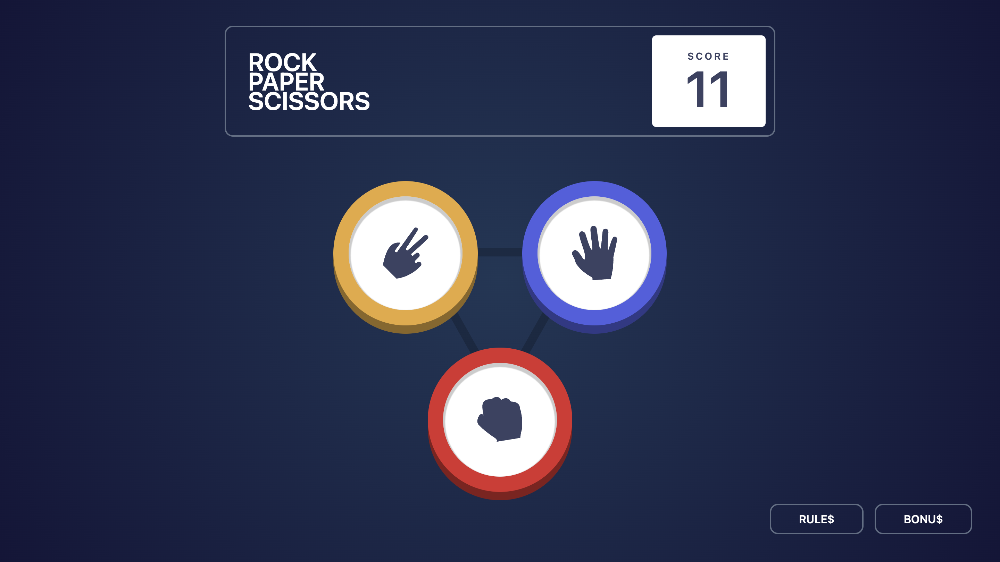
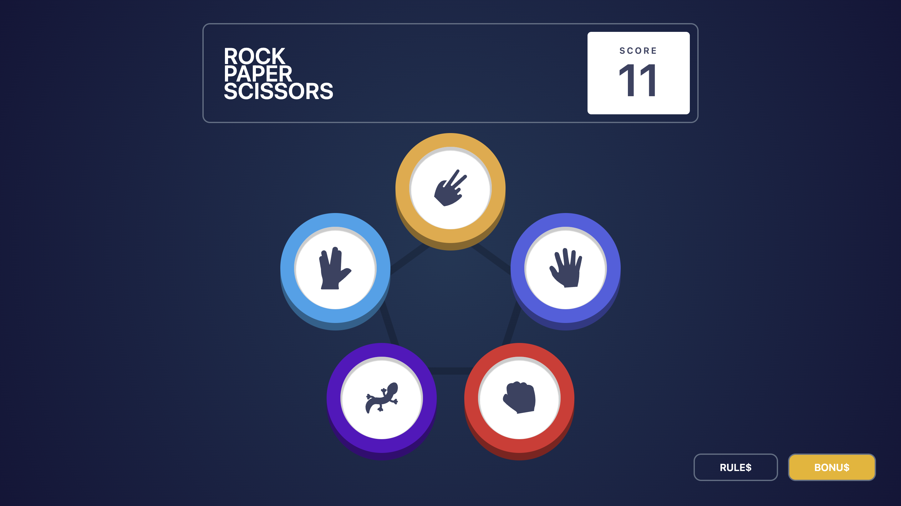
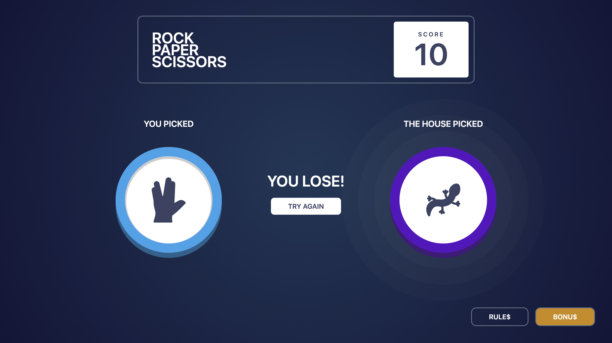

# Rock Paper Scissors game + (Bonus)

[RockPaperScissors](https://woltergray.github.io/RPSGame/)

This is a full-fledged game Rock Paper Scissors + a bonus game with Spoke and the Lizard. The game features a choice of 3 or 5 gestures, random computer moves, display of points and saving them to local storage. The game also ends if all points are lost. Adaptive design has been developed.

This is a solution to the [Todo app challenge on Frontend Mentor](https://www.frontendmentor.io/challenges/rock-paper-scissors-game-pTgwgvgH/hub).

## Features

- Gesture selection
- Random computer move
- Display of points
- View the rules of the main and bonus games
- Ability to switch between classic and bonus games

## Screenshot

## Installation

1.  Clone the repository:

        git clone https://github.com/wolterGray/RPSGame.git

2.  Install dependencies:

        npm install

3.  Run the development server:

        npm run dev

Feel free to contribute or report issues!

## Technologies Used

- Semantic HTML5 markup
- CSS custom properties
- Flexbox
- Mobile-first workflow
- [React](https://reactjs.org/) - JS library
- [Styled Components](https://styled-components.com/) - For styles
- [Tailwind](https://tailwindcss.com/) - CSS framework packed with classes
- [Framer Motion](https://www.framer.com/motion/) - Animation library

## Usage

1. Visit the [live demo](https://woltergray.github.io/RPSGame/).
2. Select your desired gesture.
3. Wait for an immediate response from the computer.
4. Gain or lose points.
5. View the rules by clicking the button below.
6. Switch between bonus and classic versions of the game.

## License

This project is licensed under the MIT License

## Authors

- GitHub - [wolterGray](https://github.com/wolterGray)
- Linkedin - [wolterGray](https://www.linkedin.com/in/vladimir-vorobiov-bba858293/)
- Frontend Mentor - [@wolterGray](https://www.frontendmentor.io/profile/wolterGray)

## Acknowledgments

- Thank for the interesting challenge [CHALLENGE HUB Rock Paper Scissors game on Frontend Mentor](https://www.frontendmentor.io/challenges/rock-paper-scissors-game-pTgwgvgH/hub).
